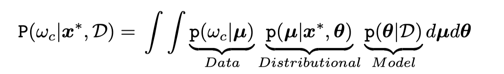
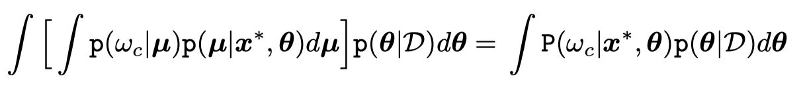
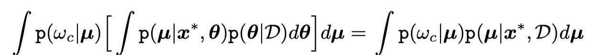
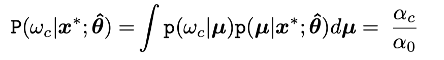
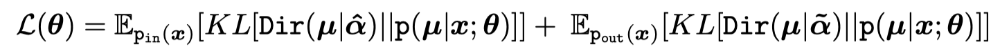
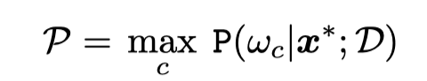
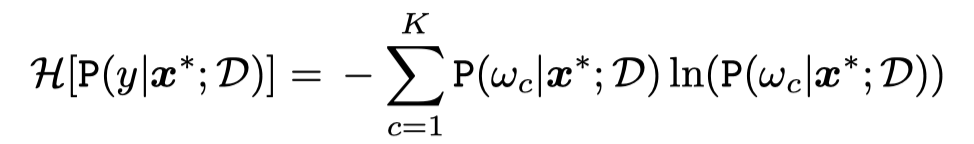
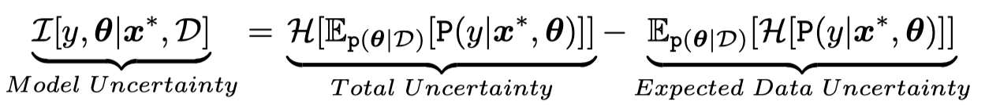
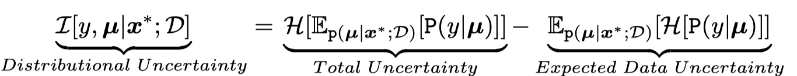
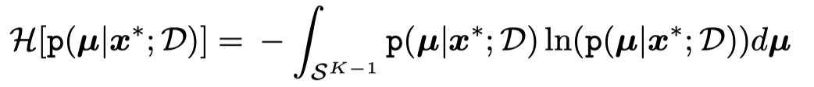

### Introduction

##### Notion

- **Model Uncertainty**:measures the uncertainty in estimating the model parameters given the training data.

- **Model Uncertainty**:reducible as the size of training data increases.

- **Data Uncertainty**:irreducible uncertainty which arises from the natural complexity of the data.

- **Distributional Uncertainty**:mismatch between the training and test distributions,the model is unfamiliar with the test data and thus cannot confidently make predictions.

### Current Methods

**Methods**: craft an implicit conditional distribution over a simplex (fig. 1b) with the attributes that it is sharp at the corners of a simplex for inputs similar to the training data and flat over the simplex for out-of-distribution inputs.

**Problems**:can not determine from the entropy whether this uncertainty is due to a high degree of data uncertainty, or whether the input is far from the region of training data.

### Prior Networks

The expected distribution $P(\omega_c|x^*,D)$ is obtained by marginalizing out the parameters $\theta$ and $\mu​$. 

if marginalizing out $\mu$,

if marginalizing out $\theta​$

Besides, assume that a point-estimate of the parameters is sufficient given appropriate regularization and training data size.

$P(\omega_c|x^*;D)​$ $\approx​$ $P(\omega_c|x^*;\hat\theta )​$

##### Dirichlet Prior Network(DPN)

The posterior over class label is given by the mean of the DIrichlet:

##### Training

minimize the KL divergence between the model and a sharp Dirichlet distribution focused on the appropriate class for in-distribution data, and between the model and a flat Dirichlet distribution for out-of-distribution data.

where $\widetilde\alpha_c=1$ and $\hat\alpha_c = \hat\alpha_0$, which is a hype-parameter.

### Uncertrainty Measure

**Max Probability**: full marginalization, for total uncertainty.

**Entropy**: for total uncertainty.

**Mutual Information**:

**differential entropy**: suited for distributional uncertainty.

### Conclusion

**Prior Networks**  allows data, distributional and model uncertainty to be treated separately within a consistent probabilistically interpretable framework.

**Differential entropy of DPN** was best for OOD detection, especially when classes are less distinct.

#### More can do

can try applying DP to CV, NLP or regression tasks.

